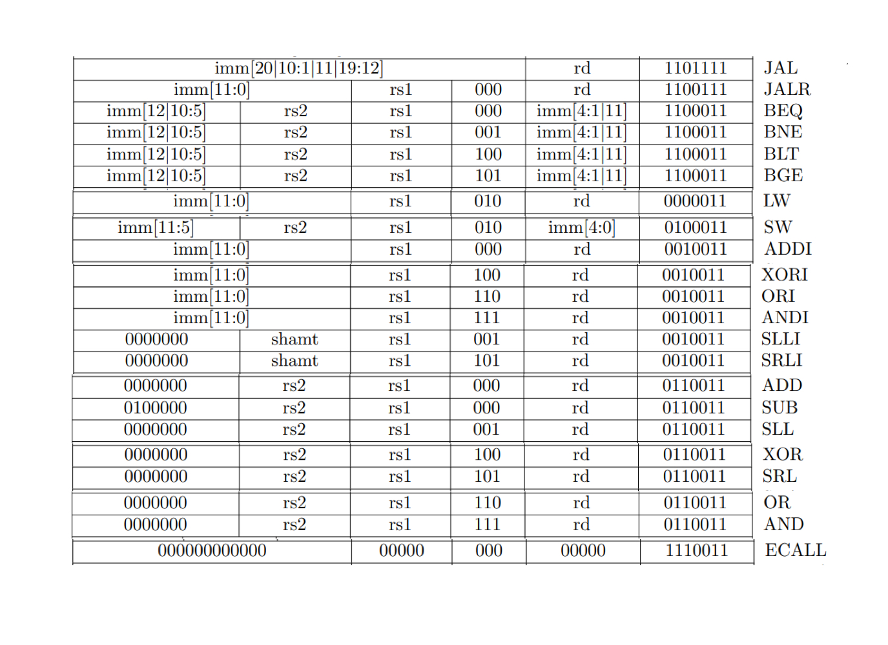
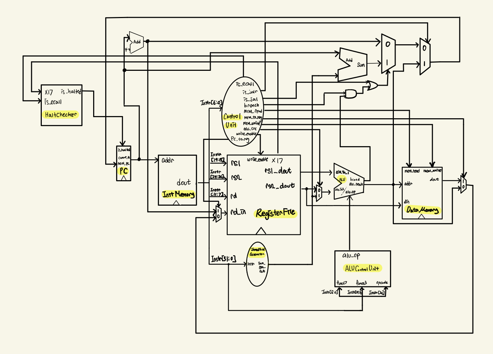

# Lab02

## Introduction

이번 Lab은 Single Cycle RISC-V CPU(RV32I)를 구현하는 것이 목적이다.
Single Cycle CPU 인만큼 한 Cycle당 실행하는 1개의 Instruction만 실행한다.
세부적으로 구현해야하는 것은 Datapath(ALU, Register File)와 Control Unit, 그리고 이들을 연결해주기 위한 세부 모듈들이다.

### RV32I Instructions

이번 Lab에서 구현하는 Instructions는 다음과 같다.


## Design

### Circuit Design

이번 Lab에서 구현한 CPU의 Circuit Design은 다음과 같다.

기존에 수업시간에 배운 Single Cycle CPU의 Circuit Design에서 기존에 배우지 않았던
ECALL Instruction을 처리하기 위해 HaltChecker모듈이 추가되었다.
InstMemory에서 opcode를 decode한 후에 GPR[x17]에 10이 들어왔는지 확인해서 프로그램 정지여부를 판단한다.
(GPR[x17]==10 ? Halt() : Nop)

### Design Detail

위 디자인에 나오지 않은 세부 디자인은 다음과 같다.

#### ALU\_OP

ALU에서 사용할 Operation을 규정하기 위해
다음 표에서 Instruciton 별로 Action을 구분하고 Action별로 Instruction을 구분해보았다.
이는 실제로 ALUControlUnit에서 사용이 된다.

##### By Instruction

| # | INSTRUCTION | ACTION |
|:-:|:-----------:|:------:|
|1|JAL|NOPE|
|2|JALR|ADD|
|3|BEQ|EQUAL|
|4|BNE|NOT\_EQUAL|
|5|BLT|LESS\_THAN|
|6|BGE|GREATER\_OR\_EQUAL|
|7|LW|ADD|
|8|SW|ADD|
|9|ADDI|ADD|
|10|XORI|XOR|
|11|ORI|OR|
|12|ANDI|AND|
|13|SLLI|SLL|
|14|SRLI|SRL|
|15|ADD|ADD|
|16|SUB|SUB|
|17|SLL|SLL|
|18|XOR|XOR|
|19|SRL|SRL|
|20|OR|OR|
|21|AND|AND|
|22|ECALL|NOPE|

##### By Action

| # | ACTION | INSTRUCTION |
|:-:|:------:|:-----------:|
|1|NOPE|JAL, ECALL|
|2|ADD|JALR, LW, SW, ADDI, ADD|
|3|EQUAL|BEQ|
|4|NOT\_EQUAL|BNE|
|5|LESS\_THAN|BLT|
|6|GREATER\_OR\_EQUAL|BGE|
|7|XOR|XOR, XORI|
|8|OR|OR, ORI|
|9|AND|AND, ANDI|
|10|SLL|SLLI, SLL|
|11|SRL|SRL, SRLI|
|12|SUB|SUB|

#### CONTROL UNIT

각 모듈에서 들어오는 Input과 Ouput을 처리하는 로직을 규정해주는 역할을 한다.
각 Ouput이 하는 역할은 다음과 같다.

| Output | Asserted | De-Asserted | Equation |
|:------:|:--------:|:-----------:|:--------:|
|is\_jalr| 1이 켜지며, PC := ALU result(GPR과 Immediate의 합)|0이 켜진다.|opcode==JALR|
|is\_jal|1이 켜지며 PC := PC+immediate|0이 켜진다.| opcode==JAL|
|branch| 1이 출력되어 bcond와 & 연산을 한다. | 0을 출력한다. | opcode == BXX|
|mem\_read| DataMemory의 Output으로 입력된 주소에 해당하는 Memory 값이 나온다.|Memory Read를 비활성화한다.| Opcode==LW|
|mem\_to\_reg| Memory의 dout을 RegiserFile의 rd\_in 전 MUX에 연결한다. | ALU의 Ouput을 RegisterFile의 rd\_in전 MUX에 연결한다.|opcode == LW|
|mem\_write| Memory Write 활성화 | Memory Write 비활성화| opcode == SW |
|alu\_src|ImmediateGenerator의 Output을 alu\_in\_2에 사용한다.| rd2\_dout을 alu\_in\_2에 사용한다.| (opcode!=Rtype) || (opcode!=SBtype)|
|write\_enable|rd에 값을 넣는다.|rd에 값을 넣지 않는다.|(opcode!=SW)  &&(opcode!=Bxx)|
|pc\_to\_reg| ReisterFile의 rd\_in에 PC+4 연결 | RegisterFile의 rd\_in에 mem\_to\_reg에 의한 결과를 넣는다. | opcode == JAL/JALR|
|is\_ecall| 1이 켜지며, GPR[x17]의 값이 10이라면 프로그램을 멈춘다.| 0이 켜진다.| opcode == ECALL|

## Implementation

기본적으로 제공이 되며, 시뮬레이션을 위한 세팅이 되어있는 top.v는 cpu.v를 호출한다.  
cpu.v에는 CPU 모듈이 제공이 되며, 하위 모듈과 하위 모듈의 Input, Output에 필요한 wire를 선언한다.
CPU 모듈 아래에 14개의 하위 모듈이 존재한다.

### mux\_pcsrc\_1: Combinational

``` text
PC:=PC+4(0)와 PC:=PC+immediate(1) 중 Output을 결정하는 MUX이다.
```

### mux\_pcsrc\_2: Combinational

``` text
mux\_pcsrc\_1의 output(0)과 ALU에서 계산된 register의 값과 immediate의 합(1) 중 Output을 결정하는 MUX이다.
```

### HaltChecker: Combinational

``` text
always @(*)
reset input이 1일 때 output인 is_halted를 0으로 초기화해주며, 
control unit으로부터 입력되는 is_ecall control bit이 1이고 GPR[x17]==10이면, 
is_halted에 1을 저장하며 프로그램을 종료한다.
```

### PC: Sequential

```text
reset input이 1일 때, current_pc를 0로 초기화해주며,
is_halted의 값이 1이라면 current_pc에 변화를 주지 않고
0이라면 mux\_pcsrc\_2의 output을 current_pc에 저장한다.
```

### InstMemory: Sequential

``` text
기본적으로 제공되는 모듈이며, 입력한 프로그램으로 부터 Instruction Sequence를 읽으며 실행한다.
```

### mux\_pc\_to\_reg

``` text
RegisterFile의 rd_in에 PC+4(1)와 mux_mem_to_reg의 output(0) 중 어느 것을 넣을지 결정하는 MUX이다. 
```

### RegisterFile

``` text
1. Read: Combinational
RegisterFile의 output에 해당하는 값(rs1_dout, rs2_dout, x17)들을 출력한다. 
2. Write: Sequential
RegisterFile의 ControlBit인 write_enable이 1이고 GPR[x0]이 아닌 다른 Register에 값을 쓰려고 할 때,
GPR[rd]에 rd_din의 값을 쓴다.
```

### ControlUnit: Combinational

``` text
Design의 Control Unit에서 기술되어있듯이 Instruction의 Type에 따라서 Control Bit의 값을 달리 출력했다.
```

### ImmediateGenerator: Combinational


위 규칙을 참고하여 작성하였다.

### ALUControlUnit: Combinational

Design의 ALU OP에서 기술되어있듯이 Instruction Type에 따라 ALU Type을 달리 출력했다.

### mux\_alu\_src

``` text
RegisterFile의 rs2_dout(0)과 ImmediateGenerator에서 만들어진 값(1) 중
어느 값을 ALU의 두번째 input으로 사용할지 결정하는 MUX이다.
```

### ALU: Combinational

``` text
지난 Lab에서 구현했던 ALU와 유사하게 ALU를 작성하였다.
```

### DataMemory

``` text
기본적으로 제공된 스켈레톤 코드 이외에 추가된 부분은 Control Bit에 따라 input과 output의 동작을 규정한 부분이다.

1. mem_read: Combinational
mem_read 비트가 켜져있으면 input으로 들어오는 주소값에 해당하는 데이터를 출력한다.
2. mem_write: Sequential
mem_write 비트가 켜지면 din으로 들어온 값을 input으로 들어온 주소에 저장한다.
```

### mux\_mem\_to\_reg

``` text
ALU의 Output(0)과 Memory에서 읽어들이는 값(1) 중 Output을 결정하는 MUX이다.
```

## Discussion

ECALL instruction을 처리하기 위한 HaltChecker처럼 Module을 새로 만들지 기존 모듈에 로직을 추가할 지 고민하는 과정에서,
코드 가독성 및 기존 모듈의 목적을 해치지 않기 위해 새로 모듈을 만들기로 결정하였다.

## Conclusion

수업시간에 배운 Single Cycle CPU를 직접 구현해보고 테스트 해보면서 
Single Cycle CPU의 작동에 대해 더 깊게 이해할 수 있었다.
