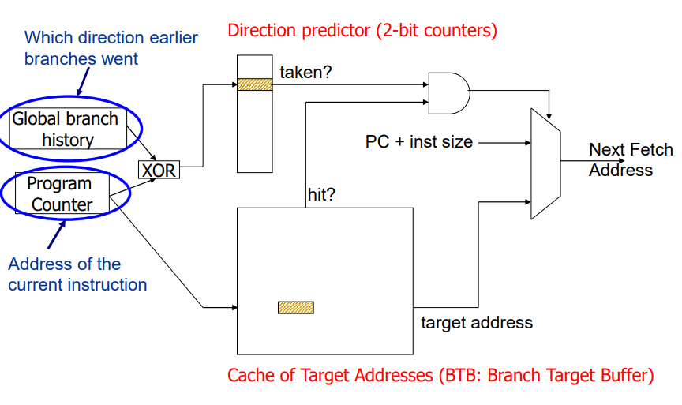

# Lab04-2: Pipelined CPU w/ control flow instructions

## Introduction

이번 Project에서는 Lab04-1에 이어 control flow instructions를 처리할 수 있는
CPU를 제작한다.
Control flow instruction의 경우 다음 PC 값이 PC+4가 아닐 수도 있는데,
다음 PC 값은 EX단계에서 알 수 있기 때문에 IF 단계에서 예측해야한다.
이 때 예측하는 방법으로 다음 4가지 방법이 존재하는데,

- Always not taken
- Always taken
- 2-bit global prediction
- Gshare

모든 방법을 구현하되, Instruction에서 가장 난이도가 어려운 단계와 직전 단계의 비교만
필요하다는 점을 참고하여 2-bit global prediction과 Gshare의 비교를 중심으로
보고서를 작성한다.

## Design

수업 시간에 배운 Gshare의 Branch Prediction의 경우 tag table, BHT, BTB 모두가
같은 Index를 공유하고 있다.
하지만, Branch Instrution의 경우 bcond를 알게 되고 BTB나 tag를 업데이트 하려고할 때,
BHSR이 달라져 다른 값을 업데이트 하게 될 수도 있다.
이는, branch outcome이 가끔 다른 branch의 결과와 연관되어있다는 점을 이용하기 위해
도입된 BHSR의 원래 목적과 달라지므로 아래 그림을 따라 구현하였다.

위 그림에서 알 수 있듯이, tag table와 BTB가 index를 공유하고 BHT는 분리되어있다.
여기에, IsBranchTable(IBT)을 추가하였는데, 이는 BTB에 있는 entry가 Branch Instruction인지
아닌지를 담기 위해서 만들었다.
IBT 또한 tag table과 BTB과 index를 공유한다.

### Next PC Lookup

1) BHSR과 PC의 XOR하여 BHT 참조하고 Taken, Not Taken 구하기
2) PC를 이용해 tag table과 BTB 참조하여 Next Instruction 구하기

### BHSR, BHT, Tag Table, BTB Update, IBT

#### BHSR

EX Stage에 Branch Instruction이 있을 경우, bcond를 BHSR에 Left Push한다.

### BHT, Tag Table, BTB, IBT Update

ID 단계의 PC 값과 EX 단계에 계산한 PC 값이 다를 때, IF, ID 단계를 flush 해주며
BHT, Tag Table, BTB를 업데이트 해준다.

## Implementation

### BranchTargetBuffer: Sequential

#### Input

- clk: Clock
- reset: Reset
- current\_pc: Current PC
- IF\_ID\_pc: PC of ID stage
- ID\_EX\_pc: PC of EX stage
- EX\_pc\_plus\_imm: PC+imm value of EX stage
- EX\_alu\_result: ALU result of EX stage
- ID\_EX\_is\_branch: True if EX stage instruction is branch instruction
- ID\_EX\_is\_jal: True if EX stage instruction is jal instruciton
- ID\_EX\_is\_jalr: True if EX stage instruction is jalr instruction
- EX\_alu\_bcond: bcond value of EX stage
- ID\_EX\_bhsr: bhsr when EX stage instruction was at IF stage

#### Output

- current\_bhsr: bhsr to save in forward using registers
- is\_flush: being used to control whehter to flush IF and ID stage or not
- next\_pc: predicted PC

#### Behavior

1. EX Stage에서 계산한 PC와 ID Stage의 PC를 비교 후
    1. 동일하다면, BHSR, BHT, Tag Table, BTB, IBT 이용해 다음 PC 계산
    2. 다르다면, EX Stage에서 계산한 다음 PC 값 이용

2. BHT 계산
3. BSHR, BHT, Tag Table, BTB, IBT 업데이트

## Discussion

수업시간에 배운 다양한 방법으로 직접 구현해보고 Cycle 수를 비교해보면서
Branch Prediction의 종류 별로 어떤 차이가 발생하는지 확인해볼 수 있었다.

## Conclusion

|Program Name|2-bit global prediction|Gshare|# Cycles Comparision|
|:--:|:--:|:--:|:--:|
|basic\_mem|35|35|=|
|ifelse\_mem|43|43|=|
|loop\_mem|294|314|<|
|non-controlflow\_mem|46|46|=|
|non\_control\_flow\_mem|59|59|=|
|recursive\_mem|1045|1035|>|

Gshare의 경우 Saturation Counter가 Index별로 있기 때문에,
초반에는 2-bit global prediction보다 Not Taken이 나오게 될 확률이 높다.
따라서, 초반에 Taken이 자주 나오게 되는 Program의 경우
잘못된 예측으로 인해 Gshare의 Cycle수가 더 많을 수 있다.
하지만, Instruction의 수가 길어질수록 Gshare의 Performance가 더 나을 확률이 높아진다.
