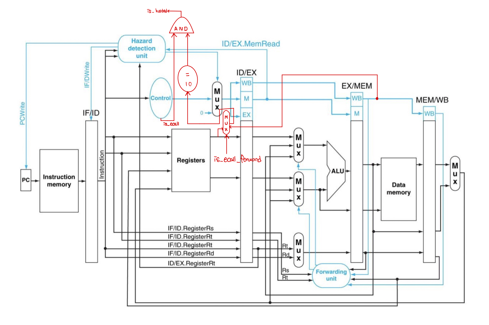
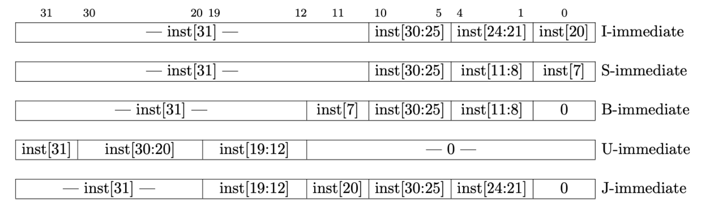

# Lab04-1: Pipelined CPU w/o control flow instructions

## Introduction

이번 Project에서는 Control Flow를 고려하지 않는 Pipelined CPU를 제작한다.
Pipelined CPU는 Multi-Cycle CPU보다 발전된 CPU이다.
Resource Reuse와 Instruction 마다 불필요한 Stage를 지워 Sincle-Cycle CPU보다 발전한
Multi-Cycle도 한번에 한 Instruction만 실행이 가능하다.
하지만, Pipelined CPU의 경우 동시에 최대 Pipeline의 개수만큼의 Instruction을 실행할 수 있다.
수업에서와 동일하게 이번 Project에서는 IF-ID-EX-MEM-WB 5개 Stage에 대해서만
Pipeline이 구성되어 최대 5개의 Instruction을 실행할 수 있다.

## Design

Pipelined CPU에서는 다음 세가지를 고려해야한다.

1. Control Bits  
하나의 CPU 내에서 다수의 Instruction이 실행될 수 있기 때문에,
각 Stage에서 실행중인 Control Bit를 Stage 이동이 있을 때마다 함께 옮겨주어야한다.

2. Stall  
Pipeline CPU에서 명령어를 실행하다보면 동시에 실행한다는 점에서
True Dependency가 존재할 경우 Stall이 필연적으로 발생한다.
이번 프로젝트에서는 Internal Forwarding을 가정하였기 때문에,
True Dependency가 존재할 경우 IF, ID Stage의 Instruction들은 2 Cycle의 Stall이 필요하다.

3. Data Forwarding  
기본 디자인에 ALU의 결과 혹은 Data Memory의 결과를 직접 ALU의 Input
혹은 Hazard Detection으로 연결시켜줄 경우,
Stall을 더 줄일 수 있게 되며, 이를 Data Forwarding이라고 한다.
마지막으로, 프로그램의 종료 여부를 확인하는 Halt Checker이 포함되어야한다.

위 세가지를 모두 고려했을 때 디자인은 다음과 같다.



<!--- Halt Checker를 위한 Hazard Detection과 Forwarding Unit 그림 수정이 필요합니다! --->
<!--- 금요일에 모여서 같이 수정해용 --->

### Specific Design

각 Stage 사이에는 Register를 두어 Stage간 이동이 있을 때 필요한 값들을 저장하고
이동시킨다.

#### Control Bits

ID Stage에서 Control Unit에 의해 Control Bit이 생성된다.

|Instruction|mem\_read|mem\_to\_reg|mem\_write|alu\_src|write\_enable|pc\_to\_reg|alu\_op|is\_ecall|
|:-:|:-:|:-:|:-:|:-:|:-:|:-:|:-:|:-:|
|ARITHMETIC|0|0|0|0|1|0|10|0|
|ARITHMETIC\_IMM|0|0|0|1|1|0|11|0|
|LOAD|1|1|0|1|1|0|00|0|
|STORE|0|0|1|1|0|0|00|0|
|ECALL|0|0|0|0|0|0|00|1|

#### Hazard Detection

아래 두 경우는 모두 True Dependency가 발생하는 상황을 가정한다.
만약 Stall이 필요한 경우, 그림에서와 같이 MUX의 Selector에 의해 모든 Control Bit는 0으로
세팅한다.

1. ECALL Instruction 외  
    Memory에서 Data를 Fetch하는 경우 Fetch가 끝나, Write Back 시까지 기다려야한다.
    따라서, 이전 Instruction이 Memory에서 Data Fetch를 하고 현재 EX 단계에 있으면 Stall한다.

    ``` verilog
    is_stall = (((use_rs1 && rs1 == ID_EX_rd) || (use_rs2 && rs2 == ID_EX_rd))
            && ID_EX_mem_read
    ```

2. ECALL Instruction  
    ECALL Instruction의 경우 ID 단계에서 값이 필요하다.
    따라서, mem\_read가 필요한 경우에는 2 cycle stall이 필요하며,
    ALU 연산 후 reg\_write가 필요한 경우 1 cycle stall이 필요하다.

    ```verilog
    is_stall = is_ecall 
        && (ID_EX_rd == 17 && (ID_EX_mem_read || ID_EX_reg_write)) 
        || (EX_MEM_rd == 17 && EX_MEM_mem_read)
    ```

#### Data Forwarding

<!---Data Forawrding 부분 부탁드립니다..!--->

## Implementation

### ALUControlUnit: Combinatinal

- input
    1. funct3
    2. funct7
    3. alu\_op
- output
    1. alu\_control

funct3, funct7, alu\_op 를 고려해 alu\_control 값을 구한다.
alu\_op의 경우 다음 경우에 따라 입력값이 달라진다.

- 00: 단순 ADD
- 01: Bxx
- 10: R-Type
- 11: I-Type ALU

### ALU: Combinational

- input
    1. alu\_control
    2. alu\_in\_1
    3. alu\_in\_2
- output
    1. alu\_control
    2. alu\_bcond

alu\_control로 연산의 종류가 결정되며, alu\_in\_1과 alu\_in\_2는 operand,
alu\_control, alu\_bcond는 result가 된다.

### ForwardingUnit: Combinational

- input
    1. rs1\_ex
    2. rs2\_ex
    3. rd\_mem
    4. register\_write\_mem
    5. rd\_wb
    6. register\_write\_wb
- output
    1. forward\_rs1
    2. forward\_rs2

ALU의 Input으로 Forwarding 할 때 어떤 값을 고를지 정해주는 Selector를 구현한 부분이다.
그 조건은 다음과 같다.

``` verilog
    if ((rs1_ex != 0) && (rs1_ex == rd_mem) && register_write_mem) begin
        forward_rs1 = 2'b01; -> MEM의 Output 선택
    end
    else if ((rs1_ex != 0) && (rs1_ex == rd_wb) && register_write_wb) begin
        forward_rs1 = 2'b10; -> WB의 Output 선택
    end
    else begin
        forward_rs1 = 2'b00; -> Register File의 Output 선택
    end
```

rs2도 rs1과 동일한 조건이므로 생략한다.

### HaltChecker: Combinational

- input
    1. x17
    2. is\_ecall
- output
    1. is\_halted

Control Unit으로부터 받은 is\_ecall이 1이고 x17 register의 값이 10이면 is\_halted를 1로,
아니면 0으로 출력한다.

### ImmediateGenerator: Combinational

- input
    1. instr
- output
    1. imm\_gen\_out

Instruction에 따라 필요한 Immediate Value를 출력한다.
다음 표를 참고하여 만들었다.



### ProgramCounter: Sequential

- input
    1. reset
    2. clk
    3. is\_stall
    4. next\_pc
- output
    1. current\_pc

매 Positive Edge마다, current\_pc값을 업데이트 한다.
reset이 1로 Setting이 되면 current\_pc는 0이 된다.
stall이 필요해 is\_stall이 1로 세팅이 되면 이전 current\_pc값을 유지한다.
앞의 두 조건이 아닌 경우 다음 PC값으로 업데이트 한다.

## Discussion

수업시간에는 Halt Checker를 위해 Data Forwarding 및 Stall를 고려하는 것을 다루지 않아
이를 위해 고민하는 시간이 필요했다.
덕분에 Data Hazard를 고려한 Pipelined CPU 구현에 대한 이해도를 높일 수 있었다.

## Conclusion

이번 Project를 구현 완료한 후 다음과 같은 실행 결과를 얻을 수 있었다.

|CPU Type|Single-Cycle CPU|Pipelined CPU|
|:------:|:--------------:|:-----------:|
|# Cycles|<!-- #inst*5 -->|<!-- #Cycles -->|

Single-Cycle CPU에 비해 확연하게 Cycle 수가 감소했다는 점을 확인할 수 있다.

<!---실제 Instruction 수와 실행한 Cycle 수를 알아야합니다.--->
