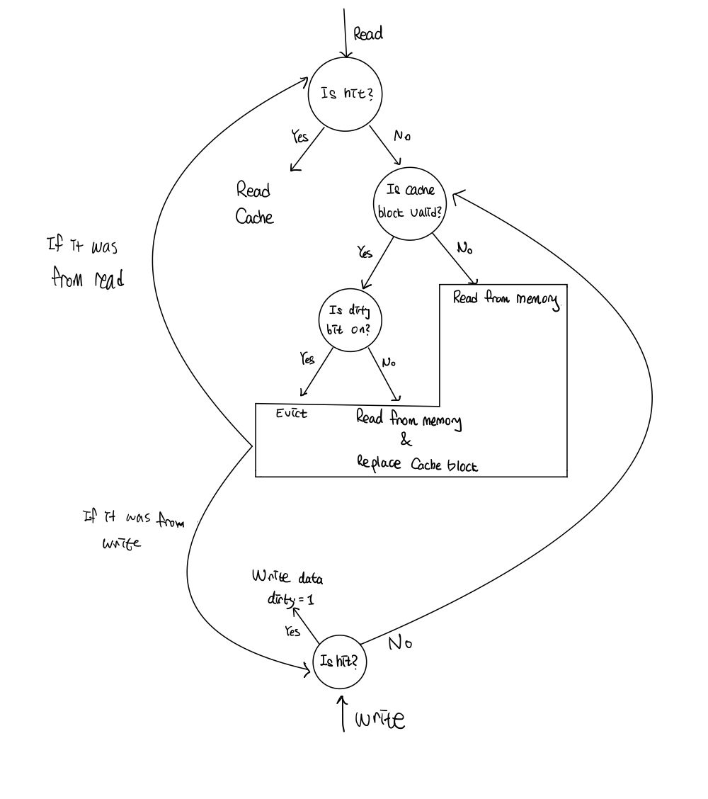

# Lab5: Cache

## Introduction

이전 Lab 까지는 Memory R/W를 1cycle에 할 수 있는 마법과 같았다.
하지만, 이전 Lab에서는 실제와 유사한 Memory의 최적화를 위해
효율적으로 메모리를 사용하기 위해 Cache를 구현한다.
Memory에 Instruction Memory, Data Memory가 존재하듯
Cache에도 Instruction Cache와 Data Cache가 존재하는데,
이번 Lab에서는 Data Cache만 구현한다.

## Design

우리는 Set-Associative Cache를 디자인 했다.

Cache의 Write Policy는 다음과 같다.

- Write-allocate
- Write-back

위 Write Policy에 따른 Cache의 작동 방식을 나타내보면 다음과 같다.



Lab instruction에 따른면 Cache Size는 256Byte로 정해져있다.
이번 과제에서는 해당 Cache Size를 고정시키며,
    다음 3가지의 변수를 매개변수화하여 매개변수에 따라
    다양한 Cache를 구현할 수 있도록 한다.

- \# sets
- \# ways
- Line Size

 예를들어, 한 개 line을 16B로 고정했을 때, 2 way set associative cache로 구현한다면 # ways 는 8이 된다.
 이 경우에 set 내에서 올바른 일치하는 태그를 지닌 캐시 라인을 선택해야 하므로 반복문을 이용해서 tag를 검사하도록 했다.
 만약 replacement를 해야 한다면 아래에서 소개하는 LRU 방식을 이용해서
 해당 cahce line의 태그를 Data Memory에 넘겨주는 방식으로 디자인했다.

### Replacement Policy: LRU

N-way Associative Cache의 구현을 위해서 어느 bank의 cache를 replace
할 지에 대한 기준이 필요하다.
여러 방법 중 LRU를 택했는데, 동일 index 중 가장 나중에 사용된 bank의
line을 evict하는 방법을 택했다.
사실 실행하는 Program에 따라 Optimal Replacmeent Policy가 다를텐데,
일반적으로 가장 이전에 사용한 Cache가 다음에 사용할 가능성이 가장 낮을 것이라고
판단하여 LRU를 사용하였다.

## Implementation

### Cache: Write - Synchronous, Read - Asynchronous

#### Parameter

- LINE\_SIZE
- NUM\_SETS
- NUM\_WAYS

#### Input

- [31:0] `addr`: Memory Address
- `mem\_read`: mem\_read control bit
- `mem\_write`: mem\_write control bit
- [31:0] `din`: data to write in memory

#### Output

- `is\_ready`: Indicates whether it's able to retrieve data immediately from memory
- `is\_output\_valid`: It's true if both `is\_ready` and `is\_hit` are true
- [31:0] `dout`: Data of memory with given address
- `is\_hit`: Indicates whether it is a cache hit

#### Asynchronous Logic

``` verilog
# outputs
assign is_ready = is_data_mem_ready;
assign is_hit = _is_hit ;
assign is_output_valid = is_ready && is_hit;
assign dout = data_bank[idx][_target_set][((bo + 0) << 5) +: 32];
```

is\_ready의 경우에는 스켈레톤 코드에 이미 data\_mem\_ready와 연결되어 있었다.
is\_hit의 경우에는 set-associative cache에서 각 line의 모든 set을 검사 해야 하므로
이를 위해 \_is\_hit register을 만들고 연결해 놓았다.
is\_output\_valid의 경우에는 is\_ready와 is\_hit이 모두 true면
true가 되도록 구현해 놓았으며 dout은 현재 입력으로 들어온 index와 아래 로직에서 찾아진
set을 이용해서 캐시 라인을 지정하고 block offset을 이용해서 출력을 하도록 만들었다.

``` verilog
# always logic
always @(*) begin
    ...
end
```

먼저 set-associative 캐시의 구현을 위해서 해당 Index의 tag와 valid를 체크해서 hit과 set을 결정한다.
여기서 hit이 아닐 경우에 먼저 비어있는 (valid가 0인) set이 존재하는지 찾고 있다면
해당 set을 사용한다.
여기서 비어있는 set이 없었을 경우에는 LRU policy를 따라서
제일 적은 counter 값을 갖고 있는 set이 선택되어 퇴출된다.
그 아래 코드에서는 위에서 결정된 바에 따라서 cache miss인 경우에
write-back을 해야 하는 경우,
그냥 데이터만 들고 오면 되는 경우를 나눠서 Data Mem에 넣을 입력을 결정하게 된다.

#### Synchronous Logic

``` verilog
# clock sync logic
always @(posedge clk) begin
end
```

여기서는 만약에 Data Memory가 mem\_is\_output\_valid를 내뱉었다면
Data Memory에 Read를 요청한 적이 있고 해당 Read가 완료된 상태라는 의미이므로
Data Mem의 아웃풋을 읽어 와서 banks를 수정 한다.
만약에 is\_write\_back이 켜져 있고 is\_data\_mem\_ready가 켜져 있다면
write\_back을 요청한 적이 있고 그것이 끝나서 data mem이 ready가 된 상태이므로
해당 cache line의 drity bit를 0으로 바꿔서 앞선 async 로직에서 해당 부분에
data read를 요청할 수 있도록 만든다.
만약에 \_is\_write\_back이 0이고 mem\_write이 켜져있고 hit라면
해당 캐시 라인 부분에 캐시의 인풋으로 들어온 din을 적어 준다.
마지막으로 LRU를 위해서 is\_hit인 경우에는 해당 라인의 counter bank를 1 늘려준다.

### Hazard Detection: Modified

기존에 구현된 Hazard Detection 에서 다음 조건이 추가되었다.

``` verilog
if ((EX_MEM_mem_read || EX_MEM_mem_write) && !(MEM_is_hit && MEM_is_output_valid && MEM_is_ready)) begin
    is_stall = 1;
    cache_stall = 1;
end
else begin
    cache_stall = 0;
end
```

현재 Mem 단계에서 R/W 를 하고 있으나, is\_hit&&is\_ready&&is\_output\_valid == 1 이 아니라면
아직 메모리에서 데이터를 읽어오고 있거나 제대로 된 데이터가 아니므로 Stall 한다.
그리고 이 경우에 MEM 단계까지 stall을 확장해야 하므로 이 부분이 추가적으로 cpu.v에 구현되어 있으며,
Data Forwarding을 고려해서 WB stage까지 stall을 시키도록 구현했다.

## Discussion

기존의 magic memory가 아닌 실제 memory와 같이 delay가 있는 상황에서
최적화를 위해 Cache를 구현해보면서 이론으로만 알던 Cache에 대해
깊에 알 수 있는 기회가 되었다.

## Conclusion

해당 과제를 통해 캐시 친화적인 프로그래밍을 이해할 수 있었고, 캐시를 직접 구현해 봄으로써
어떠한 식으로 replacement policy가 동작하는지 이해할 수 있었으며,
direct-mapped cache와 set-associative 캐시의 차이에 대해 명확하게 이해할 수 있었다.
또한, 아래의 실험을 통해 cycle과 hit ratio를 256B 크기의 용량,
16B 크기의 캐시 라인을 지닌 캐시의 다양한 세팅에 대해서
naive한 매트릭스 연산과 optimal한 매트릭스 연산의 차이를 분석해 볼 수 있었다.

### Cycle 수 비교

|# Cycles|Directed Mapped Cache|2 way set associative Cache|4 way set associative Cache|8 way set associative Cache|
|:------:|:---:|:---:|:---:|:---:|
|Naive|91,610|96,778|96,220|111,854|
|OPT|97,812|88,982|98,172|113,090|

### Hit ratio 비교

|Hit Ratio|Directed Mapped Cache|2 way set associative Cache|4 way set associative Cache|8 way set associative Cache|
|:------:|:---:|:---:|:---:|:---:|
|Naive|67.57% (1687/2499)|58.66% (1466/2499)|60.58% (1514/2499)|55.38% (1384/2499)|
|OPT|64.22% (1605/2499)|65.34% (1663/2499)|60.02% (1500/2499)|54.90% (1372/2499)|

### 분석

Direct Mapped Cache(1 way set associatvie cache)에서
Naive가 Opt보다 높은 Hit Ratio와 낮은 Cycle을 보여주었다.
이에 대해서는 Optimal 코드가 비록 매트릭스 A에 대해서
타일 크기 (= 캐시 라인 크기) 만큼씩 값을 불러와 사용하여 cache-friendly 하지만
이 캐시 라인과 다른 매트릭스가 사용하는 캐시 라인의 index가 일치하게 되는 경우가
잦게 발생하여 eviction과 write-back이 자주 발생하기 때문으로 분석할 수 있다.

2-way의 경우에 optimal한 코드가 다른 모든 경우에 비해서 높은 성능을 보였는데,
우선적으로 index가 겹치는 경우가 생기더라도 Least Recently Used 방법을 사용해
eviction이 일어나게 되므로 더 flexible하게 캐시 미스를 처리할 수 있기 때문으로 보인다.
Optimal 코드가 온전하게 타일 크기 (= 캐시 라인 크기)의 사용이 끝날 때까지 eviction 없이
캐시에 해당 부분을 저장해서 반복적으로 가져올 수 있기 때문에
훨씬 좋은 성능을 보일 수 있었다.
cache hit ratio는 directed mapped cache에서 Naive보다 적게 나왔음에도 불구하고
replacement policy 덕분에 write-back을 하는 경우가 적어 최종적인 사이클은 더 적게 나왔다고 분석하였다.
이에 반해 Naive 코드 같은 경우에는 cache-friendly 하지 않게 짜여져 있어 다양한 캐시 라인에 계속 접근을 하므로
eviction이 자주 일어나고, dirty한 cache line의 eviction도 자주 일어나 싸이클이 더욱 증가할 수밖에 없다고 분석하였다.

마지막으로 4 way와 8 way의 경우를 살펴보면,
전반적으로 성능이 감소하는 모습을 볼 수 있었다.
이는 너무 많은 way를 갖게 될 경우에 replacement policy인 LRU와 코드간의 조합이 잘 맞아야 성능이 잘 나올 수 있게 되는데,
LRU 만으로는 앞으로 어떠한 캐시 라인이 자주 쓰이게 될지,
어떠한 캐시 라인이 앞으로 쓸모 없을지 정확하게 판단하기 어렵기 때문이며
어떠한 replacement policy를 쓰더라도 하드웨어 입장에서는 완벽한 판단을 내리기가 어렵기 때문이다.
그러나 way가 증가할수록 이러한 replacement policy의 역할이 중대해지기 때문에
성능이 조금씩 낮아질 수밖에 없다고 분석 하였다.
