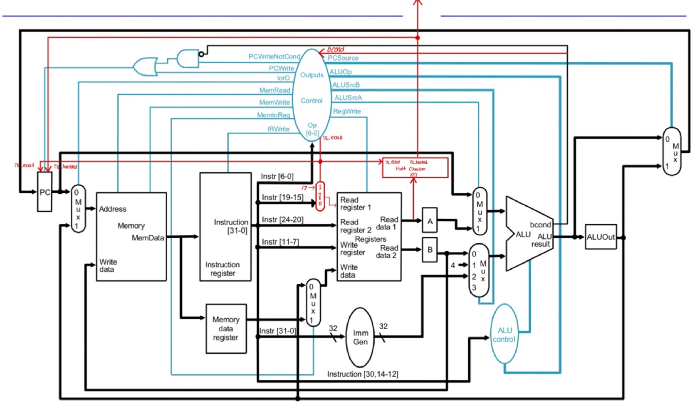
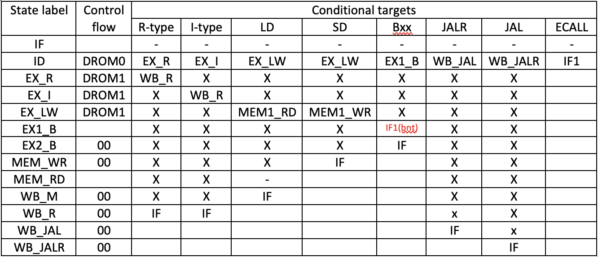
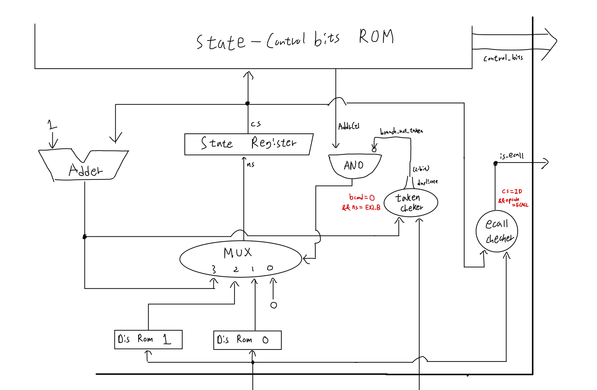
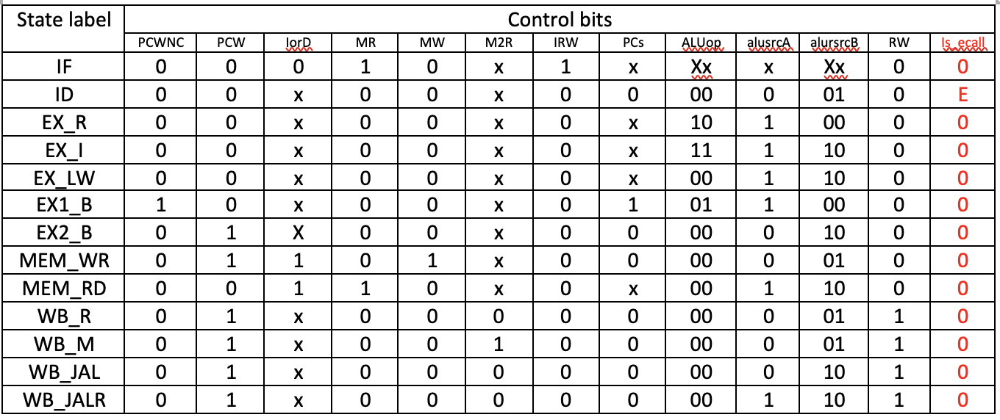

# Lab03

## Introduction

이번 Lab은 지난 Lab에서 구현한 Single-Cycle CPU를 발전시켜 Multi-Cycle CPU를 구현한다.
Single-Cycle CPU에서는 구조적 효율성이 떨어져, 다수의 Unit이 중복되어있다는 문제가 있다.
따라서, 매 사이클마다 CPU 연산의 각 Stage를 실행하도록 설계를 하여
한 Cycle 내에서는 동일 한 Unit은 1번만 실행되도록 만든다
(ex, PC := PC+4와 EX의 ALU연산은 다른 Cycle에서 실행한다).
또한, Multi-Cycle CPU를 구현함에 있어 필요한 Micocode Controller를 구현한다.

## Design

### Circuit Design

Lab Instruction으로 제공되는 기본 Circuit에서 필요한 Unit을 더해 디자인하였다.

#### 추가 된 점

1. 다음 Section에서 설명할 Microcode Controller에서 branch condition에 따라
실행 할 EX stage가 달라지기 때문에, Microcode Controller에 bcond를 연결해주었다.

2. ECALL 처리
    1) ECALL 요청 시 halt 조건을 확인 하기 위해 GPR[x17]이 10인지 확인할 필요가 있다.
    따라서, Register의 rs1 input에 MUX를 연결하여
    Microcode Controller에서 is\_ecall control이 1이면 rs1 에 17이 들어가도록 만든다.
    2) HaltChecker 모듈을 추가하여 is\_ecall이 1이고 GPR[x17]이 10이라면 is_halted가
    1을 반환하도록 만든다.
    3) PC에서는 is_ecall이 1이고 is_halted가 1이면 더이상 PC update를 하지 않도록 만들어
    프로그램이 끝나도록 만든다.

#### Key Points
1. **Difference btw Single-Cycle CPU & Multi-Cycle CPU**  
Single-Cycle CPU는 한 Cycle 내에 하나의 연산 모두를 처리해야한다.
예를 들어, R-Type 연산의 경우 어떤 곳에서는 PC := PC+4 를 수행하고
다른 곳에서는 GPR[rd] = GPR[x1] (op) GPR[x2] 를 수행하고 있을 것이다.
따라서, ALU를 2개 이상 존재해야 한 Cycle 내에 Instruction을 성공적으로 처리할 수 있다.
하지만, Multi-Cycle의 경우 ALU, Memory 등을 하나만 두어
한 Stage에서는 각 Unit을 1번만 사용할 수 있도록 만든다.
또한, Single-Cycle CPU와 달리 Multi-Cycle CPU의 경우 각 Stage 마다 하나의 Cycle이 필요하고,
Instruction 마다 필요한 Stage가 다르기 때문에 더 빠른 실행시간을 기대할 수 있다.

2. **Why Multi-Cycle CPU is better?**  
    1) 공간 효율성 증가  
    Single-Cycle CPU와 달리 CPU 내 Unit이 중복으로 존재하지 않기 때문에,
    공간의 효율성이 증가한다.
    2) 실행 시간 감소
    Single-Cycle CPU의 경우 가장 시간이 많이 필요한 Instruction을 기준으로
    CPU 연산 시간을 정한다. 하지만, Multi-Cycle CPU의 경우 각 Stage 별로
    한 Cycle씩 필요하기 때문에, 불필요한 Stage만큼 대기할 필요가 없다.
    (ex, R-Type 연산은 MEM 단계를 기다릴 필요없다.)

3. **Resource Resue Design & Implementation**  
    1) Memory  
    Instrucion Memory와 Data Memory를 하나로 합치고 둘 중 어느 것을 사용할 지
    Control Bit으로 정할 수 있도록 만든다.
    IF 단계에서 Instruction 메모리를 읽은 후 MEM 단계에서 Data Memory를 읽을 수 있기
    때문에, Register(Instruction Register, Memory data Register)를 두어
    저장하도록 만든다.
    2) ALU  
    ALU는 PC:=PC+4, Branch Condition Check, ALU 계산시에 필요하다.
    따라서, Input을 고를 수 있는 MUX와 Control Bit를 추가하고,
    계산 결과를 저장할 수 있는 Register(ALUOut)를 둔다.
    Branch Instruction의 경우에는 EX의 첫번째 Stage에서 Not Taken일 때 결과값을
    먼저 계산하여 ALUOut에 저장해두고, Taken일 때에는 ALU의 결과값과 ALUOut의 결과값 중
    ALU의 결과값을 택하게 만든다.
    

### Microcode Controller

#### State Design Table

Microcode Controller의 각 State와 Instruction 별로 다음 Stage와
아래 Circuit Design에서 AddressSlector의 MUX가
어느 input을 따라 다음 State가 정해지는 지 Control Flow를 볼 수 있다.
하나 중요하게 봐야하는 점은 Branch Instruction 인데, 다른 Instruction과 달리
EX State가 2개로 나눠져있다.
이는 Branch Condition을 확인할 때 ALU를 한번 사용하고,
Branch Taken일 때, ALU를 한번 더 사용하기 때문이다.

#### Circuit Design

##### AddressSlector

- input
    - opcode
    - bcond
    - AddrCtl
    - $\mu + 1$
- output
    - next\_state

1. MUX는 (0) 0으로 갈지, (1) Dispacth Rom0 에서 다음 State를 결정할지,
(2) Dispatch Rom1 에서 다음 State를 결정 할지,
(3) 이전 State 바로 다음 State로 갈 지 결정한다.
이는, AddrCtl을 통해 알 수 있다.
2. opcode는 각 Dispatch ROM0은 ID단계에서 어느 State로 Jump할 지,
Dispatch ROM1은 EX단계에서 어느 State로 Jump할 지를 결정한다.
opcode를 입력으로 받아 Instruction을 알 수 있다.
3. Branch Taken 여부는 다음 State가 EX2\_B 일 때, bcond를 보고 확인하는데,
bcond가 0이고 다음 State가 EX2\_B라면 Branch Taken으로 본다.
Branch Taken일 경우 Dispatch ROM1에서 다음 State인 EX2\_B로 이동하지만,
Branch Not Taken일 경우 IF로 가도록 만든다.

##### EcallChecker

ECallChecker는 현재 State가 ID이고, ECALL Instruction일 경우 is\_ecall이 1로 만든다.

##### MicroStorage

Micro Storage는 현재 state를 보고 어떤 ControlBits와 AddrCtl를 결정한다.
AddrCtl은 위 TruthTable의 ControlFlow를 따라 결정되며,
ControlBits는 아래 TruthTable를 통해 알 수 있다.

Don't Care Bit의 경우 실제 구현상 0으로 처리하였다.

## Implementation

위 Design을 바탕으로 아래 Module을 수정/제작 하였다.

### CPU

CPU는 SubModules 및 SubModules를 위한 input 및 output에서 필요한 wire를 선언한다.

### PC: Synchronous

reset이 input으로 들어오면 current pc를 0으로 초기화한다.
매 Positive Clock Edge마다 다음 조건이 충족될 경우 다음 PC로 Update한다.

1) is halted 가 0
2) is\_ecall이 1 혹은 write\_enable\_pc가 1

### MUX: mux\_mem\_addr: Asynchronous

IorD를 Control Bit로 받아 0일 경우 PC를 통해 Instruction 주소를,
1 일 땐, ALUOut에서 계산된 Data Memory 주소를 출력한다.

### ControlUnit: Synchronous

위 Microcode Controller 디자인을 따라 구현하였으며, 3개의 SubModules를 가진다.

- EcallChecker: Asynchronous
- AddressSelector: Asynchronous
- MicroStorage: Asynchronous

### MUX: mux\_rs1\_src: Asynchronous

is\_ecall을 Control Bit로 받아 1일 경우 17을 출력하고,
0일 경우 Instruction Decode를 통해 얻은 Instr[19:15]를 출력하여
rs1의 input 을 결정한다.

### MUX: mux\_write\_data: Asynchronous

Register Write할 때 사용할 Data를 어디서 가져올 지 결정한다.
MemtoReg를 Control Bit로 받아 1일 경우 Memory Register의 값을,
0일 경우 ALUOut의 결과를 출력한다.

### HaltChecker: Synchronous

매 Positive Clock Edge마다 Program Halt 여부를 결정한다.
is\_ecall일 때, Register의 Read data1에서 GPR[x17]이 출력되고,
값이 10일 경우 is\_halted를 1로 켜준다.

### ImmediateGenerator: Asynchronous

아래 그림을 참고하여 제작하였다.

### ALUControlUnit: Asynchronous

ALUOp, funct3, funct7을 통해 다음 연산을 결정한다.
|ALUOp|Instruction Type|Should Consider funct3| Should Consider funct7|
|:---:|:--------------:|:--------------------:|:---------------------:|
|00|Something needs ADD not in EX Stage|X|X|
|01|Branch|O|X|
|10|R-Type|O|O|
|11|I-Type|O|X|

### MUX: mux\_alu\_src\_1: Asynchronous

ALUSrcA를 Control Bit로 받아 1일 땐, Register의 Read Data1을 출력하고,
0일 땐, Current PC 값을 출력한다.

### MUX: mux\_alu\_src\_2: Asynchronous

ALUSrcB를 Conrol Bit로 받아 00일 땐, Register의 Read Data2을 출력하고,
01 일땐 4를 출력하고, 10일 땐, immediate value를 출력한다.
(11은 사용하지 않는다.)

### ALU: Asynchronous

Operand로 두개의 값을 Input으로 받으며, ALUOp를 통해 어떤 연산을 할 지 결정한다.
Branch 연산일 경우 bcond를 output으로, 아닐 경우 alu\_result로 값을 출력한다.

### MUX: mux\_next\_pc: Asynchronous

PCSource를 Control Bit로 받아 어느 값을 다음 PC로 사용할지 결정한다.
0일 경우 직전 ALU의 연산 결과를, 1일 경우 ALUOut에 저장된 값을 출력한다.

## Discussion

Microcode Controller의 State와 Control Bit를 결정하는 과정에서 어려움이 많았다.
State의 경우 과제 공지를 통해 나온 방식을 따르되,
Branch Instruction의 경우 Branch Condition을 위한 연산과
Taken 시에 PC:=PC+Immediate를 위한 연산을 해야하기 때문에
EX State를 2개로 나눴다.
Control Bit은 우선 생각하는 대로 구현한 후 오류 발생 시 고쳐나가는 방식을 택했다.

## Conclusion

1. **Number Of Cycles**
    |  Program |basic_ripes|loop_ripes|
    |:--------:|:---------:|:--------:|
    | # Cycles |    117    |    978   |

2. **Lab Conclusion**  
Multi-Cycle CPU가 공간과 시간 모두에서 효율적이라는 점을 확인할 수 있었다.
